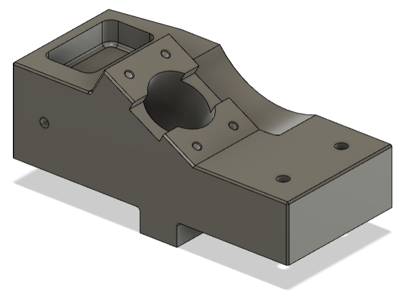
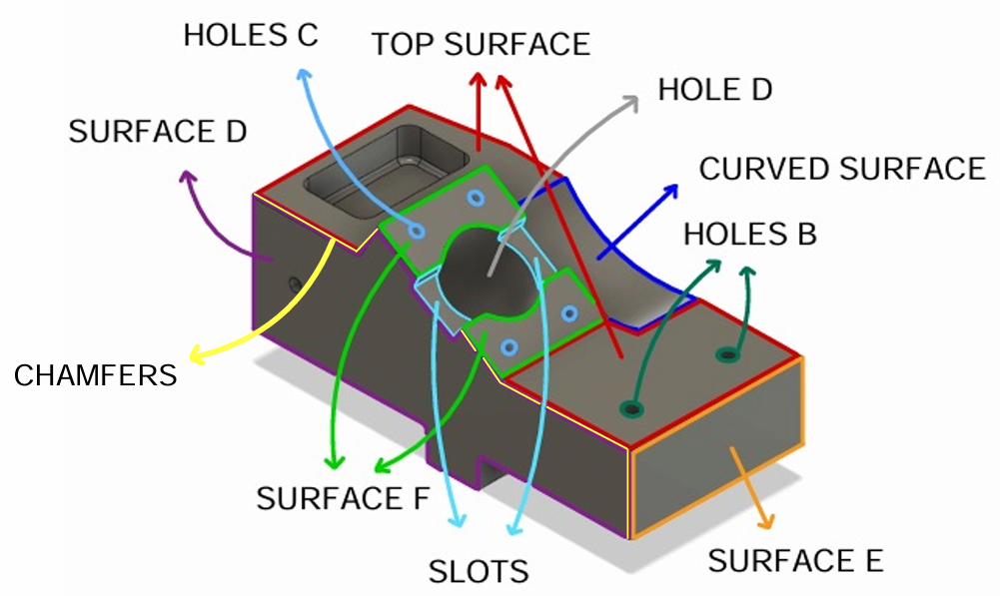
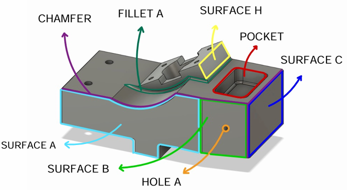
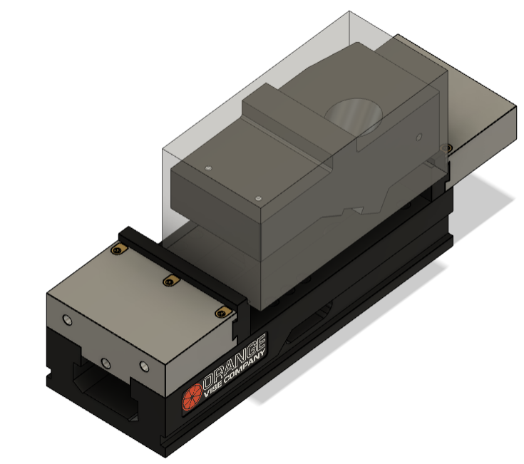
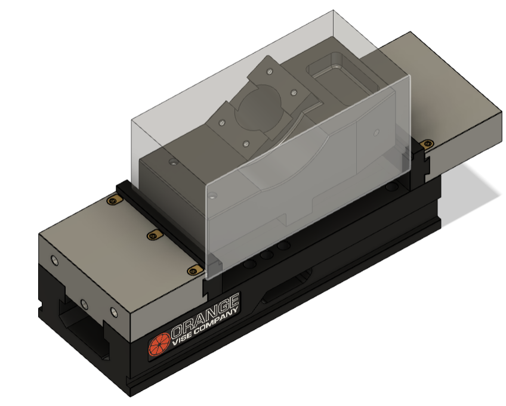
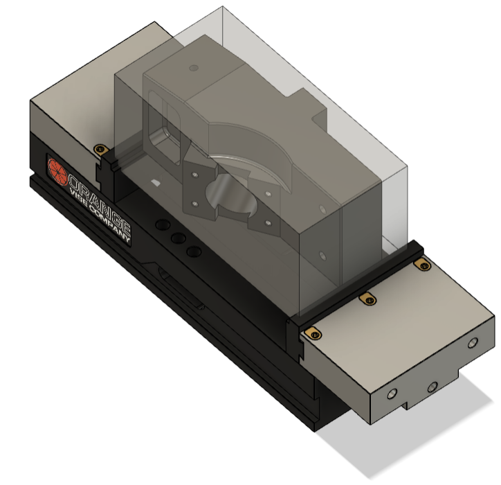

  

  # Manufacturing Process of a Custom Workpiece

  **A complete CAD/CAM process-planning study developed in Autodesk Fusion 360.**

  
  
  
  

## Overview

This project develops the manufacturing process for a parametrically assigned workpiece, starting from its 2D technical drawings and ending with a complete, verified machining plan in Autodesk Fusion 360.

The work covers the full process-planning chain:

- reconstruction of the part and stock models;
- feature recognition and operation selection;
- precedence and setup planning;
- fixture and accessibility analysis;
- selection of commercial Sandvik tools and inserts;
- calculation of cutting parameters, spindle speed, power, and surface roughness;
- estimation of machining time and production throughput.

The goal was not only to reproduce the geometry, but to design a feasible process that satisfies geometric tolerances and surface-finish requirements under realistic machine, fixture, and tooling constraints.

## Key results

| Metric | Result |
| --- | ---: |
| Machining strategy | 3 setups |
| Estimated total cycle time | 2,586 s = 43 min 06 s |
| Theoretical throughput | ~1.4 parts/hour |
| Main operation families | 6 |
| Peak calculated spindle speed | 13,793 rpm (14,000 rpm machine limit) |
| Peak calculated cutting power | 15.85 kW (16 kW machine limit) |

> These are analytical process-planning results based on the assigned machine constraints. The cycle time includes machining, tool changes, loading/unloading, and spindle repositioning. It does not include inspection, tool wear, machine availability, or unplanned downtime.

## Design and machining features

The workpiece combines planar and curved surfaces, pockets, slots, chamfers, fillets, and multiple hole features. Datum relationships and geometric tolerances strongly influence both the machining sequence and the orientation of the part.

  
  

The assigned configuration uses a `264 × 126 × 128 mm` stock, an annealed high-carbon unalloyed steel classified as `P.1.3.Z.AN`, M7 threaded holes, and a 30° inclined feature.

## Process-planning workflow

1. **Interpret the drawings** - identify functional surfaces, datums, tolerances, roughness targets, and special requirements.
2. **Create the CAD and stock models** - reproduce the assigned parametric geometry in Fusion 360.
3. **Map features to operations** - select facing, peripheral milling, drilling, reaming, thread milling, and boring operations.
4. **Build the precedence graph** - order operations according to datum creation, tolerance dependencies, and accessibility.
5. **Define the setups** - choose workpiece orientations and clamping surfaces compatible with the four-axis machine and the assigned vise.
6. **Select tools and cutting data** - use Sandvik Coromant catalogues to match tools, inserts, material, and operation requirements.
7. **Verify feasibility** - check spindle speed, cutting power, engagement, surface finish, and machine limits.
8. **Estimate productivity** - combine machining, tool-change, repositioning, and handling times into the final cycle estimate.

## Three-setup machining strategy

  
  
  

### Setup 1 - datum and lower surfaces

The stock is clamped on its smaller lateral faces. This provides access to the bottom and lateral surfaces, establishes the bottom surface as Datum A, and machines Surface D as Datum B.

### Setup 2 - top and inclined features

The already machined shorter lateral surfaces are used for clamping. This orientation exposes the top, pocket, inclined surface, and related holes while preserving the spindle orientation required by the perpendicularity constraints.

### Setup 3 - remaining external features

The final orientation exposes the remaining faces, curved surface, and chamfer. It completes the geometry while using previously machined surfaces as reliable clamping references.

Three setups were selected because a two-setup solution could not satisfy all accessibility, vise-clearance, datum, and tolerance requirements. Minimizing the number of setups would also not necessarily minimize the total machining time.

## Operation verification

Each operation was checked before being included in the final sequence.

| Check | Method |
| --- | --- |
| Tool suitability | Tool geometry and limits matched to the feature and workpiece material |
| Spindle speed | Calculated from cutting speed and tool diameter, then checked against the assigned 14,000 rpm limit |
| Cutting power | Worst-case analytical demand checked against the assigned 16 kW limit |
| Feed rate | Derived from spindle speed, feed per tooth, and number of cutting edges |
| Surface finish | Theoretical roughness compared with drawing requirements |
| Productivity | Machining and non-cutting times included in the cycle-time estimate |

The complete report documents the selected Sandvik tool codes, cutting data, assumptions, formulas, and operation-level calculations.

## Repository contents

| File | Description |
| --- | --- |
| [`CAM_workpiece.f3d`](CAM_workpiece.f3d) | Autodesk Fusion 360 model containing the workpiece and CAM project |
| [`project_report.pdf`](project_report.pdf) | Full 38-page process-planning and verification report |
| [`docs/images`](docs/images) | CAD figures extracted from the project report |

## Open the project

1. Download [`CAM_workpiece.f3d`](CAM_workpiece.f3d).
2. Open Autodesk Fusion 360.
3. Select **File → Open** and upload the `.f3d` archive.
4. Use [`project_report.pdf`](project_report.pdf) to follow the feature naming, setup decisions, tool selection, and calculations.

## Notes

This repository documents an academic manufacturing-process design project. The reported cycle time, throughput, spindle speed, and cutting power are analytical estimates derived from the planned sequence; they are not measurements from series production on a physical machine. Real implementation would require validation against the selected machine's power-torque curve, duty rating, tooling condition, fixturing, and safety margins.
